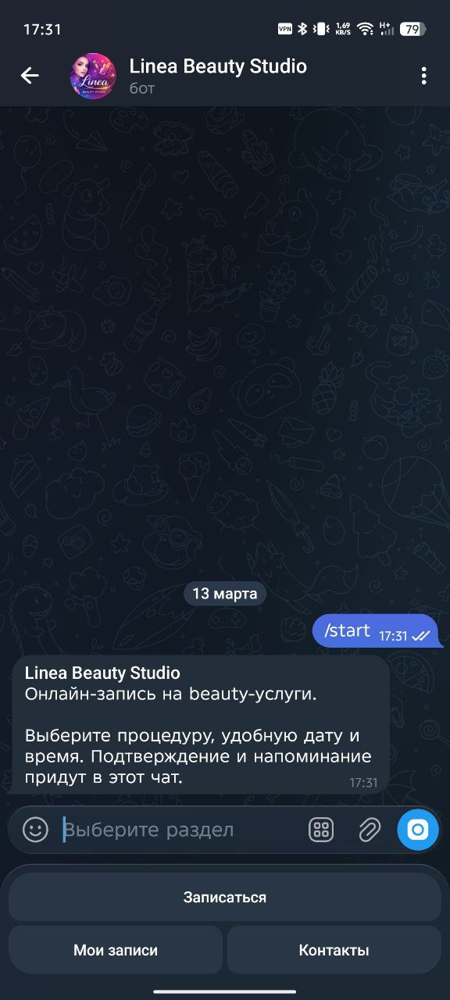
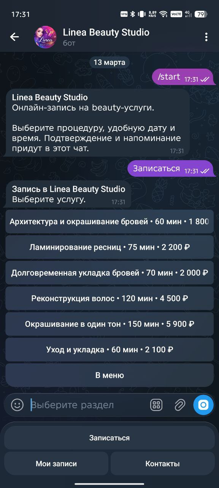
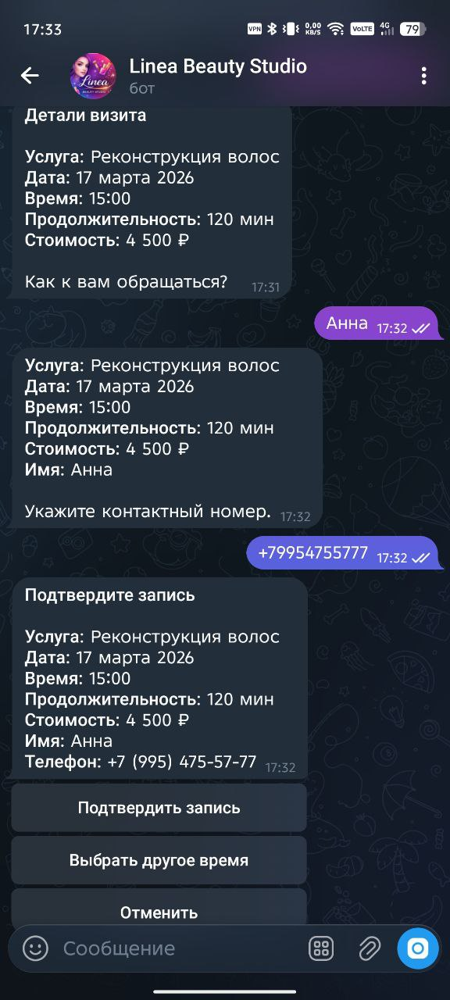
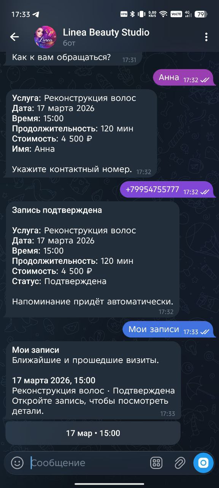
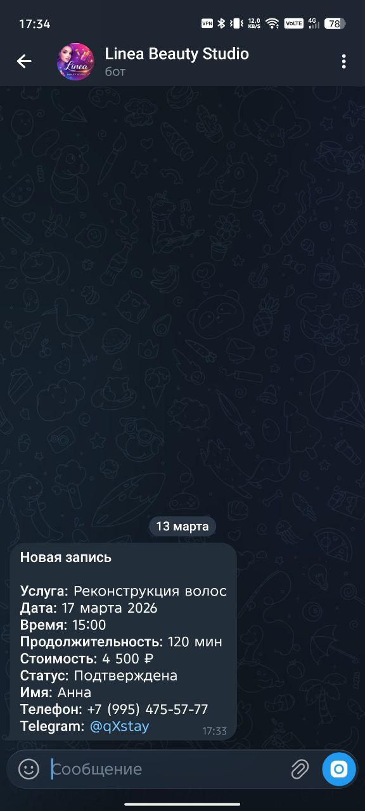

# Telegram Beauty Booking Bot

Showcase-проект Telegram-бота для онлайн-записи в beauty studio на примере бренда Linea Beauty Studio. Репозиторий собран как аккуратный портфельный кейс: с реалистичным пользовательским сценарием, чистым Telegram UX, SQLite-хранилищем и автоматическими напоминаниями.

## Что умеет бот

- приветствует пользователя и показывает аккуратное главное меню
- оформляет запись: услуга -> дата -> время -> имя -> телефон -> подтверждение
- сохраняет запись в SQLite
- показывает ближайшие свободные даты и слоты
- защищает от бронирования занятого окна
- показывает раздел `Мои записи`
- позволяет отменить активную запись
- отправляет уведомление администратору о новой записи и отмене
- планирует напоминание о визите через APScheduler

## Стек

- Python 3.12
- aiogram 3
- SQLite
- python-dotenv
- APScheduler

## Скриншоты

### Главное меню



### Выбор услуги



### Подтверждение записи



### Подтверждённый визит



### Уведомление администратору



## Сценарий записи

1. Пользователь открывает `/start`
2. Выбирает `Записаться`
3. Выбирает услугу
4. Выбирает дату и свободное время
5. Вводит имя и телефон
6. Подтверждает запись
7. Получает подтверждение в чате
8. Видит запись в разделе `Мои записи`

## Уведомление администратору

После подтверждения бот отправляет администратору отдельное сервисное сообщение с услугой, датой, временем, именем клиента, телефоном и Telegram-контактом. При отмене записи администратор получает отдельное уведомление об отмене.

## Структура проекта

```text
.
├── app
│   ├── database
│   │   ├── connection.py
│   │   ├── repository.py
│   │   └── schema.py
│   ├── handlers
│   │   ├── booking.py
│   │   ├── common.py
│   │   └── records.py
│   ├── keyboards
│   │   ├── booking.py
│   │   └── main_menu.py
│   ├── services
│   │   ├── booking_service.py
│   │   ├── catalog_service.py
│   │   └── reminder_scheduler.py
│   └── utils
│       ├── config.py
│       ├── dates.py
│       └── states.py
├── data
│   └── services.json
├── screenshots
│   ├── 01-welcome.jpg
│   ├── 02-services.jpg
│   ├── 05-confirmation.jpg
│   ├── 06-booking-success-and-records.jpg
│   └── 07-admin-notification.jpg
├── .env.example
├── .gitignore
├── bot.py
└── requirements.txt
```

## Локальный запуск

```bash
python3.12 -m venv .venv
source .venv/bin/activate
pip install -r requirements.txt
cp .env.example .env
python bot.py
```

SQLite-база будет создана автоматически по пути `data/bookings.db`.

## Пример `.env`

```env
BOT_TOKEN=123456:telegram-bot-token
ADMIN_CHAT_ID=123456789
DATABASE_PATH=data/bookings.db
SERVICES_PATH=data/services.json
STUDIO_NAME=Linea Beauty Studio
STUDIO_PHONE=+7 (999) 123-45-67
STUDIO_ADDRESS=ул. Радищева, 18, 2 этаж
STUDIO_HOURS=Ежедневно, 10:00-21:00
TIMEZONE=Europe/Moscow
REMINDER_HOURS_BEFORE=2
BOOKING_WINDOW_DAYS=7
TIME_SLOTS=10:00,11:30,13:00,15:00,17:00,19:00
```

## Что показывает этот кейс

- умение собирать реалистичный Telegram-flow для клиентского beauty-сервиса
- аккуратную структуру проекта без избыточной архитектуры
- работу с aiogram 3, FSM, клавиатурами и SQLite
- продуманный showcase-UX, ориентированный на GitHub и портфолио
- базовую продуктовую логику: запись, статусы, отмену, напоминания и уведомления администратора
